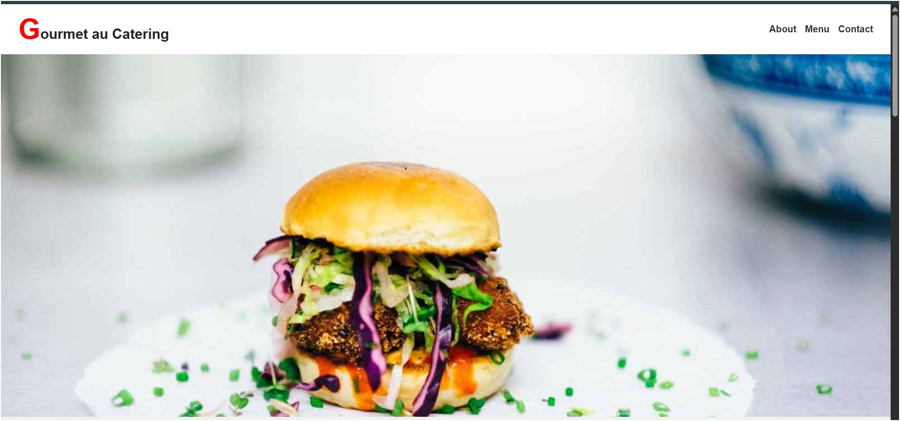

# 🍽️ Gourmet au Catering Website

  

Welcome to **Gourmet au Catering** — a stylish, responsive catering website built using pure **HTML5** and **CSS3**.  
Crafted with clean design principles, mobile responsiveness, and smooth user experience in mind ✨

---

## 🚀 Live Demo

🔗 [Watch the Demo Video on LinkedIn](https://www.linkedin.com/posts/shimaafouad_html-css-frontenddevelopment-activity-7317470438706544641-SokK?utm_source=share&utm_medium=member_desktop&rcm=ACoAAD9NRL4BoCP7OZoKo-mzzGgfZ-Met38zCJA)  
🌐 [Live Website (if hosted)](#)

---

## ✨ Key Features

- 🎯 **Hero Section** with impactful visuals  
- 📖 **About Section** introducing the service  
- 🍽️ **Menu Layout** to showcase offerings  
- ✉️ **Contact Form** for customer inquiries  
- 📱 **Fully Responsive Design** for all devices  

---

## 🧠 What I Learned

This project allowed me to:

- Structure semantic and clean HTML5 code  
- Use modern CSS3 for styling and layout  
- Apply Flexbox and Grid to build complex designs  
- Enhance mobile responsiveness and UX  

---

## 🛠️ Technologies Used

| Tech   | Purpose             |
|--------|---------------------|
| HTML5  | Page structure       |
| CSS3   | Layout & Styling     |
| VS Code | Development         |
| Chrome DevTools | Testing & Debugging |

---

## 👨‍💻 Author

**Eng.Shimaa Fouad**   

💼 Front-End Developer | Web Developer 

🔗 [GitHub: shimaaf0uad](https://github.com/shimaaf0uad)  

📧 Email: shimaa.fouad002@gmail.com  

🌐 [Portfolio LinkedIn]:(https://www.linkedin.com/in/shimaafouad)

---

## 🙌 Show Some Love

If you liked this project:

- ⭐ Star the repo  
- 🍴 Fork it  
- 🗣️ Share it  
- 💬 Drop your feedback  

---

  Made with ❤️ and a sprinkle of CSS magic.

